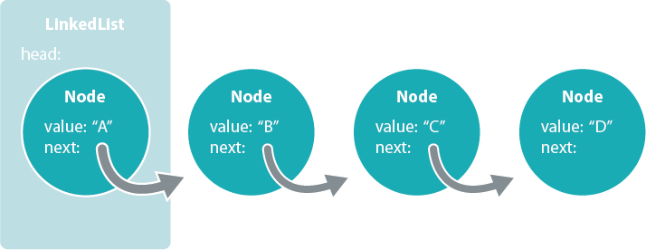

# Data Drill: Linked List

## Summary
  
*Figure 1*. Visual representation of a linked list.

A [linked list][wikipedia linked list] is a data structure made from a sequence of nodes.  In a linked list, each node contains two pieces of data: (1) a value and (2) a reference to the next node in the sequence.  The list itself contains a reference to the first node, the head.  This is displayed visually in Figure 1.

We're going to build our own linked list data structure in Ruby.

### About Linked Lists
Why use a linked list over another list structure like an array?  The principal benefit of a linked list over a conventional array is that list elements can inserted and removed without reallocating or reorganizing the entire structure because the list items do not need to be stored contiguously in memory or on disk.

On the other hand, linked lists do have some limitations.  Simple linked lists do not allow efficient indexing or random access to any item in the list.  Searching through the list to find a particular node is always done as a linear search, beginning with the head node and proceeding through the list.  Thus, basic operations could require scanning most or all of the list elements—for example, obtaining the last node of the list, finding a node with a given value, or locating the place where a new node should be inserted.

## Releases
### Release 0: Implement a Linked List
We're going to build a linked list data structure.  As always, we need to write tests for our code.  Here's a run down of the functionality that our linked list will need.

- Push an item to the end of the list.
- Pop an item from the end of the list.
- Insert an item at the front of the list (i.e., make the new item the head).
- Remove the head from the list, preserving the rest of the list.
- Insert an item at a given index.
- Remove an item at a given index.
- Return an item from the list matching a given value.

*Hint:*  What classes do we need to build in order to implement a linked list?

### Release 1: Implement a Stack and Queue with a Linked List *(optional)*
In [another challenge][stack and queue challenge], we are asked to build stack and queue data structures.  Each of these data structures was built on top of an array.  Let's update our stack and queue to use our new linked list instead of an array.  The behaviors of these classes should not change.  In other words, *how* the classes work will change, but *what* they do will remain the same.

## Conclusion
Do we understand what a linked list is? Could we explain it to someone with a non-technical background?  What are some real-world situations that could be modeled as a linked list?

[stack and queue challenge]: ../../../data-drill-stack-and-queue-challenge
[wikipedia linked list]: http://en.wikipedia.org/wiki/Linked_list
