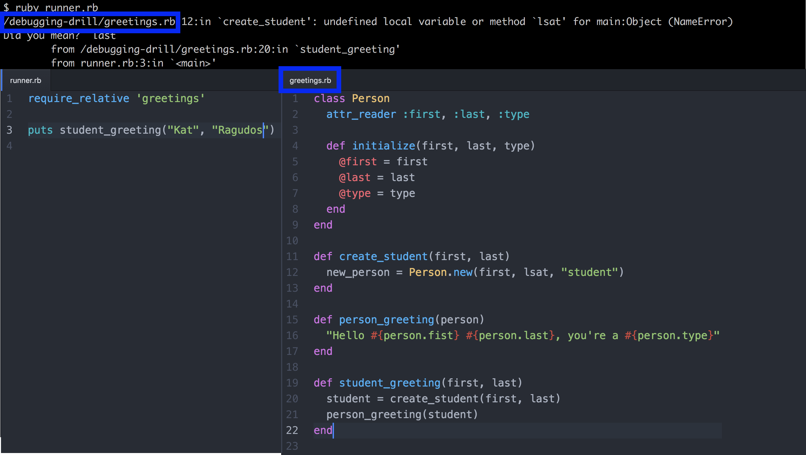
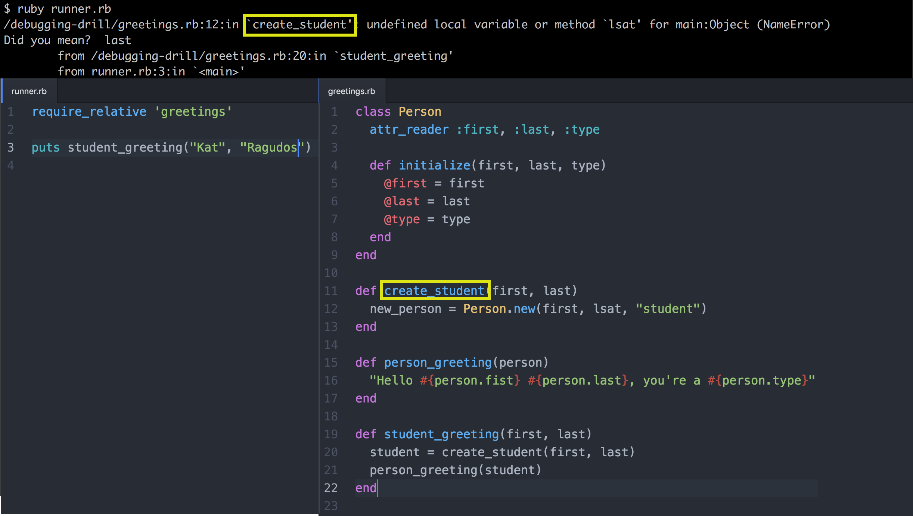
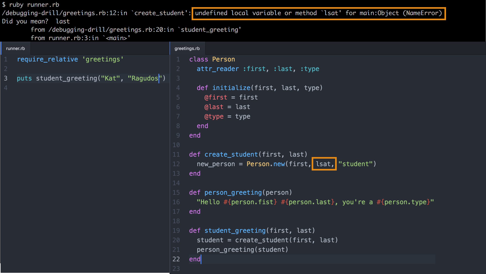
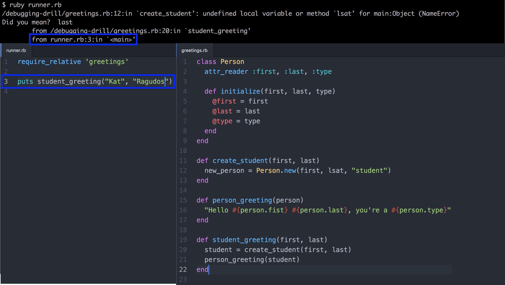
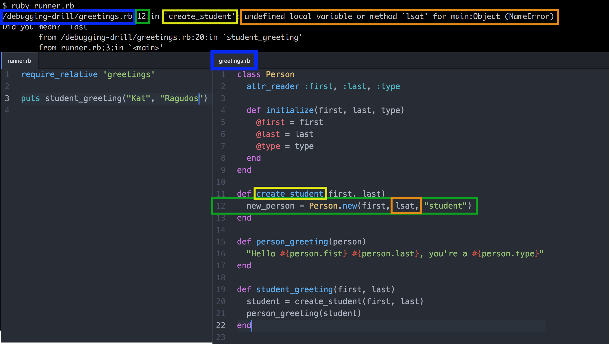

# Debugging Drill: Read the Error

## Summary
In this challenge, we're going to debug two small methods. Tests have been provided that describe the desired behaviors of the two methods. Our task is to deduce why the methods aren't working as intended and then to fix them.

When our code doesn't work, there is always the temptation to jump back to our code with the assumption that we know what's wrong, skipping over the error message entirely. Resist that temptation.


### The Reality of Bugs
The code we write will often not work the way we intended—at least not on the first pass. Through different techniques, we can try to control the risk of our programs not working and minimize the impact of bugs (e.g., minimizing the time it takes to debug). We'll be exposed to different techniques throughout Dev Bootcamp. For example, running our code early and often as it's being developed should help us to find bugs in one area of our program before they've spilled into other areas. Test-driven development is another technique that can help.


### How to Read a Stack Trace
Reading a stack trace effectively will save us time and anguish throughout our careers. Ruby provides a wealth of information about our code when things go wrong, and we need to use all of it to make debugging as quick and painless as we can.

**What's a Stack Trace?**

We've already seen a *stack trace* many times! A stack trace is the *error message* we see when a bug in our Ruby program causes Ruby to crash. Every time we've had a bug that upset Ruby, it provided a stack trace so we could track down the problem in our code.

We will see stack traces every day for the rest of our programming careers. As we might imagine, it's important we become familiar with the structure of a stack trace. The better we know how to read one, the faster we can debug our code.


*Figure 1*. Image showing a stack trace and the Ruby files that were run.

We're going to learn about the structure of a stack trace by stepping through an example step-by-step. We'll be highlighting pieces of the stack trace along the way using the image seen in Figure 1.  

In this image there are three components:

- The terminal where we run `ruby runner.rb` and get back a stack trace (error) from Ruby because there is a bug in our code.
- The contents of `runner.rb`, the Ruby file we're running.
- The contents of `greetings.rb`, the Ruby file that `runner.rb` is using.

Before continuing, let's familiarize ourselves with the code shown in Figure 1:  read it, understand it, and run it.  Once we're comfortable with the code, we can continue.

**Taking it Step-By-Step**




*Figure 2*. Identifying the file in which the bug presents itself.

The first step in reading this stack trace is to look at the first line. In Figure 2, the highlighted section shows that this particular error occurred in the file `/path/to/code/greetings.rb`—our exact path might look different, but should end with `greetings.rb`. This path matches up with the location of our `greetings.rb` file, and it means our error occurred somewhere in that file.  Useful information!


*Figure 3.* Identifying the line number where the bug presented itself.

Continuing to read the stack trace, we see a number just to the right of the file path we just read (see Figure 3). That number is the *line number* where this error occurred. We now know that the error occurred in `greetings.rb` on the 12th line of the file.  How nice of Ruby to help us narrow this down!




*Figure 4*. Identifying the method that was being executed when the bug presented itself.

Ruby gives us a little more information. In Figure 4, we see that Ruby explicitly tells us that this error occurred in the `create_student` method. It might feel redundant here, but knowing the name of the method is nice if we're getting an error in someone else's code. We might not be able to dig into their code right away and find the file and line number, but at least we know the name of the method that blew up.




*Figure 5*. Identifying the specific exception.

The next section of the stack trace shows us the *exception* (see Figure 5). This is Ruby's error message. It's telling us that there was a reference that it didn't recognize:  an undefined local variable or method. We're even told what code Ruby didn't recognize:  `lsat`.  Then Ruby tells us this is a `NameError`. That's pretty useful information.

Reading this error message is the *most important part of reading a stack trace*. If we're not reading what Ruby is telling us is wrong, how can we hope to ever debug our code? Ruby's now told us where the error is and the nature of the error. We should be grateful!


*Figure 6*. Identifying how the code executed until the bug presented itself.

Now that Ruby has told us about the error, it's going to help us trace what led to the error. In Figure 6 we see that Ruby is telling us that the error in `create_student` occurred because the faulty `create_student` method was run by the `student_greeting` method on Line 20 of `greetings.rb`.

Ruby is helping us trace the path of execution through the program. It wants us to see how the error happened by showing us how we reached the faulty line of code.

With this information we know that this call to our broken method came from the method `student_greeting`.




*Figure 7*. Tracing execution further down the stack trace.

If we continue down the stack trace, we see that it was `runner.rb` on Line 3 that called `student_greeting` (see Figure 7). We already know that `student_greeting` called `create_student`. We also know that `create_student` caused an error.

If we read it bottom-to-top, we can say:

> The code on Line 3 of `runner.rb` called the code on Line 20 of `greetings.rb` which in turn called the code on Line 12 of `greetings.rb`. The code on Line 12 crashes because Ruby didn't recognize the undefined local variable or method called `lsat`.




*Figure 8*.  Matching elements of the stack trace to the parts of the code that generated the error.

Putting all the pieces of this stack trace together (see Figure 8), we're able to see the following:

With this stack trace we have learned that Line 12 of `greetings.rb` was executed as part of the `create_student` method. When it ran, the program was unable to find the variable `lsat`, and it crashed. This all happened because we ran `runner.rb` in the terminal, and it called `student_greeting` which called our buggy method `create_student`.

So why couldn't Ruby find `lsat` on Line 12 of `greetings.rb`? Well, this is the most common bug of all, we had a typo!


##Releases
###Release 0: Method Definitions
```bash
$ rspec spec/mean_spec.rb
```
*Figure 9*.  Running only the tests in the file `spec/mean_spec.rb`.

We'll begin by debugging the method `mean`, which is defined in the file `mean.rb`.

We have two tests describing how we want the `mean` method to function; the tests can be found in `spec/mean_spec.rb`. Run the tests to see them fail (see Figure 9).  Both tests will fail.  In doing so, they will provide us with information on why they fail.  In other words, our tests set expectations for the `mean` method, and when those expectations aren't met, the failing tests inform us what went wrong.

Don't change the tests.  Rather, change the method *definition* in order to pass the tests.  When both tests pass, the bug is fixed.


###Release 1: Type Error
We'll now debug the `sort` method, which is defined in `sort.rb`.

Ruby is a [dynamically typed](http://en.wikipedia.org/wiki/Type_system#Dynamic_typing) programming language.  When we assign variables, we don't have to specify their assigned values' types.  In other words, we don't have to declare that that the variable `name` is an instance of the `String` class and variable `numbers` in an instance of the `Array` class.  And when we define methods that accept arguments, we don't have to specify that the arguments are going to be instances of any particular classes.

Most of the time, this is a good thing.  It allows us, as rubyists, to use [duck typing](http://en.wikipedia.org/wiki/Duck_typing#In_Ruby), which is a form of dynamic typing.  In duck typing, we're not interested in an object's class or what type of object it is, rather we're interested in the behaviors of the object or what methods we can call on it.

Sometimes we can run into problems when the objects our program receives are of a different type than the ones we expected. This is called a `TypeError`.

To begin debugging the `sort` method, let's get information about what's going wrong by running the tests that describe how the method should behave.  The tests are written in the file `spec/sort_spec.rb`.

When all the tests pass, the bug is fixed. As with debugging the `mean` method, don't change the tests.  Rather, change the method in order to fix the bug.


##Conclusion
Our code is going to contain bugs.  Learning how to approach fixing them is a real skill.

There is usually more than one way to fix a bug.  In this challenge, our options for fixing bugs were limited because we were not able to change the tests (i.e., how we wanted to call the methods and how they behaved).

Here's a juicy question: why might we decide to rewrite a method's invocation (what arguments we pass to the method when we call it) as opposed to the method's definition (how it works)? In a small program like this, the code is flexible enough to warrant either choice. When working on larger applications, you have to constantly be aware of *how* you are fixing bugs. Fixing one bug can easily cause more bugs or confusion down the line if you are not careful.
