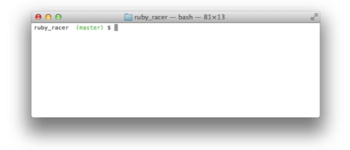

# Ruby Racer: Outrageous Fortune

## Summary
  
*Figure 1*.  A game of *Ruby Racer*.

Vroom vroom! We're going to build a simple game called *Ruby Racer*. This is a game in the same sense that [Chutes and Ladders](http://en.wikipedia.org/wiki/Snakes_and_Ladders) is a game: roll the die and move forward.  There's no strategy or decision making, just hope for big rolls.

The game is a race between two players.  Both players start at the beginning of the track, side-by-side.  Players take turns rolling a die and advancing along the track until one of them reaches the end of the track and wins the game.  (See Figure 1.)

Some challenges in building our game will be (1) managing the state of the game (e.g., keeping track of player positions) and (2) transforming data from one structure to another (e.g. transforming the game data into a printable board).

### Code Base
In this challenge, we're going to begin with some provided code.  We have some fully functional code:  a `Die` class that represents a real-world, rollable die and then a few methods that will help us update the screen (see `die.rb` and `reset_screen.rb`.

We also have some partially completed code:  the `RubyRacer` class where we'll find a number of empty method definitions with comments about what they should do. We'll need to actually write the bodies of these methods ourselves (see `ruby_racer.rb`).

And finally we have the driver code in `runner.rb`.  This code provides a basic outline for running a game of Ruby Racer.

We may alter the provided code as necessary; however, the code base is generally well-written, and we should pay attention to the style, what methods exist, what their inputs and return values are, and how they segment the actions necessary to play the game.

## Releases
### Release 0: Make the Game Playable
We need to build on the provided code base to create a working version of *Ruby Racer*.  Most of the work will be in filling out the `RubyRacer` class, but we might want or need to change some of the other code as well.

Let's remember to test our code.  While the behaviors of the `RubyRacer` class are described in comments related to each method, they are not documented in our test suite.

*Note:* We do not need to test the code in `runner.rb` or `reset_screen.rb`.

### Release 1:  Add Features *(optional)*
What would make this game more fun?  Now that the basic version of the game is working, let's see if we can't spice it up a little bit.  Below are some suggestions, but we're free to add our own features as well.

- Why limit the game to two players always labeled `a` and `b`?  Let's allow any number of players to sign up for a race and select their own symbols.
- Instead of using single-letter symbols for each player, we could use ASCII art ([vehicle examples](https://sites.google.com/site/asciisandbox/art/vehicles), [convert words](https://github.com/miketierney/artii)).
- We could make the game more like Chutes and Ladders, providing power-ups to move a player forward or power-downs to slow them or move them backward.
- We could make the game less random, giving players more control over how they move across the board.

*Note:*  Let's try to test our additions if we can. If not, it's ok, but we should reflect on why we couldn't test these behaviors and add it in a `tests.md` file.

## Conclusion
How were we able to keep track of the state of our game?  What data structures did we choose to represent data?  Did our choices make it easy to access and update our data?

Did we encounter any edge cases or unexpected situations?  For example, a player advancing past the edge of the board?  Multiple winners (i.e., the game not stopping the first time a player finishes)?  How did we handle these situations?  Did our code remain readable?
