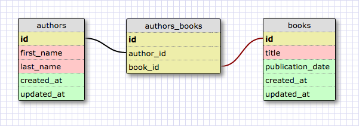

# Schema Design: Many-to-many Schema

## Summary
In [another challenge][one-to-many challenge], we looked at the one-to-many relationship between two database tables.  In this challenge we're going to look at another relationship:  many-to-many.

Here are some situations for when a many-to-many relationship would be appropriate.  A magazine has many subscribers, and a subscriber can subscribe to many magazines.  A customer reviews many products, and a product has many reviewers.  An author can write many books, and a book can have many authors.

Conceptually, many-to-many relationships are relatively easy to understand, but they can be slightly more complicated to implement.  In order to model a many-to-many relationship, we need to introduce a third table, a *join table*.

  
*Figure 1*.  Modeling a many-to-many relationship between authors and books.

In Figure 1 we model one of the examples given earlier, using the *authors_books* table as a join table between the authors and books tables.  Look at the join table.  What data does it hold?

The join table contains two foreign key fields:  one that points to an author and one that points to a book.  For a given author whose id we know, how would we use the join table to find which books the author had written?

*Note:*  A join table can have more fields than just the two foreign key fields.  For example, a join table linking magazines to subscribers could hold information like the date the subscription began, the length of the subscription, etc.  In such cases, we would also add *created_at* and *updated_at* fields.


## Releases
### Pre-release:  Read and Run the Product Reviews Script
We have a small script that allows us to view product reviews.  We can view reviews written by a specific user or the reviews written for a specific product.  In addition, we can view reviews which a specific user has favorited.  (see `runner.rb`)

```bash
# View reviews made by a user
$ ruby runner.rb users ooh_la_larain reviews

# View reviews favorited by a user
$ ruby runner.rb users dont_be_thad_guy favorites

# View reviews for a product
$ ruby runner.rb products camera reviews
```
*Figure 2*. Passing command line arguments to view specific sets of reviews.

The script relies on command line arguments.  We can see the three valid argument combinations in Figure 2.  To get a sense for how the script works, let's run the script passing in the three sets of arguments from Figure 2.  Then, let's read through the code base. See which classes are present and how they relate to each other. We can proceed to the next release when we feel comfortable that we understand the how the script works and how the different classes relate to each other.


### Release 0: Design a Schema to Support Product Reviews
The user of this script is interested in expanding it, and we need to design a database schema that will support the application. In other words, we need to design a database that will store the data that is currently contained within the file `runner.rb`: which users there are, their usernames, which reviews each has written, which products there are, for which product each review was written, etc.

We should use the [schema designer] to create our schema. When our schema is complete, take a screenshot of the design and commit it.


## Conclusion
Like the one-to-many relationship, the many-to-many relationship is fundamental to designing a database schema.  We need to recognize when such a relationship is appropriate and then know how to implement the relationship using a join table.

[one-to-many challenge]: ../../../database-drill-one-to-many-schema-challenge
[schema designer]: https://schemadesigner.devbootcamp.com/
