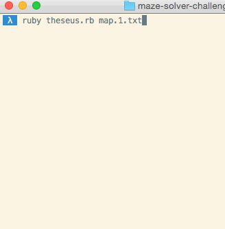

# Labyrinth

> "So it was that the hero met the Minotaur in the gloomy depths of the Labyrinth and was not afraid." —Theseus and the Minotaur

In this challenge you will need to create a program that determines if a maze is solvable or not. You will build a program step by step to:

 * Read in a file containing the Maze
 * Represent the Maze in code
 * Use a strategy to determine if the Maze is solvable

**Tests are required**. This challenge can easily go awry if you're not careful testing even your most basic methods. For example, a simple bug like mixing up x and y could have some confusing and non-obvious consequences. If you're not sure how to test something, ask for help.

## Reading the Maze

Your maze will be defined in a text file that looks like this:

```
o#........
.#####.##.
.......##.
######.#*.
.......###
```

 * `#` is a wall
 * `.` is an open tile
 * `o` is your start point
 * `*` is your goal

The maze does not "wrap", this isn't Pac-Man!

You have been given a method called `read_maze` to get you started. It takes a file, and returns a 2D array representing the maze. See the spec file for an example of how this works.

## Release 1, Small Problems First

Your task is to write a **recursive** algorithm that determines if a map is solvable or not. Your `is_solvable?` method, however it is written, should return `true` if the finish (`*`) is reachable from the start (`o`). It should return `false` if it is impossible to reach the end (no path exists). You do not need to actually return the path itself.

But this is a big problem! If we're going to make any headway we'll need to break it down. Before you begin, work with your pair to think about what kinds of questions you'll need to answer. Here are a few to get you started:

 * Where is the start position?
 * Is a specific position (x,y) open? Is it a wall? Is it a goal?
 * If I'm looking at a specific position, what are its neighbors?
 * How can I tell which neighbors of a specific position are open?

Try to come up with small questions like these, and write methods that answer them. Don't even worry about exploring or recursing yet. If you solve small pieces of the problem like this now, then solving the bigger problem of recursively exploring will be easier later.

For each method you write, write a test. This is not optional!

We'll use the methods we write in this release in the next one.

## Release 2, Exploring

Now that we've written methods that answer some of our smaller questions, we can use them when we write our recursive algorithm.

To recap, here's our task:

> Your task is to write a recursive algorithm that determines if a map is solvable or not. Your `is_solvable?` method, however it is written, should return `true` if the finish (`*`) is reachable from the start (`o`). It should return `false` if it is impossible to reach the end (no path exists). You do not need to actually return the path itself.


Hint: your recursive algorithm will need to explore a cell at a time until it finds the end, or determines that the end is unreachable. How will it explore recursively? How will it know if it found the end? How will it know if the end can't be reached?

Make sure you test on different kinds of maps. Some examples are contained in this repository.

## Stretch 1, Iterative

Come up with an iterative solution, them compare and contrast it with your recursive solution. Does it work the same? Which do you prefer?

The iterative version can, with a relatively small change, behave in one of two ways:




Can you create iterative solutions that mimic both?

## Stretch 2, Harder Mazes & Open Terrain

Run your solver against harder maps or more open terrain. Does it work? If not, why? What did you have to change to get it to work?

```
...#.....#
...#.#.#.#
...#.#.#.#
.#...#.#*#
.#########
........o.
####.#####
..........
.###.####.
...#......
```


```
.................
........#........
........#.*......
........#........
........#........
........#........
........#........
........#........
........#........
.o......#........
........#........
.................
```
