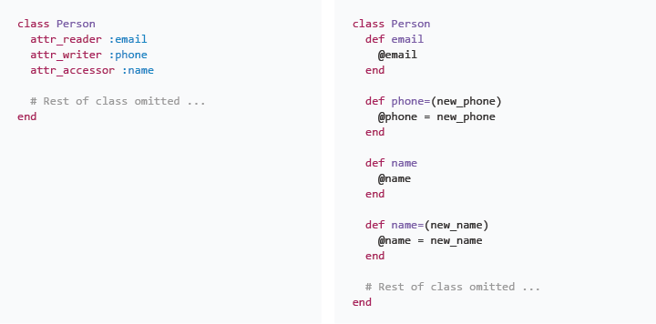

# Ruby Drill: Accessor Methods

## Summary
We've been making use of objects defined in Ruby's core library:  integers, strings, arrays, hashes, etc.  And we're beginning to design our own custom objects to perform tasks unique to our applications.

When we design objects in Ruby, we write classes and then create instances of those classes.  Each instance holds a unique set of data (i.e., has a unique state).  If we created a `Person` class, we could make individual instances of the class—each with a unique name, phone number, e-mail address, etc.  In this `Person` class example, we would refer to name, phone number, and e-mail address as *attributes*, and we store their values in instance variables.

### Readers and Writers, Getters and Setters
We often want our objects to be able to share their attributes (i.e., share the values of their instance variables).  For example, we can ask an instance of the `Person` class what its name is, what its phone number is, etc.  Sometimes we also want to make it possible to reassign an object's attributes—for example, changing a person's name.

To make it possible for an object to share the values of its attributes or to have them reassigned, we create *accessor methods*.  Methods that return the value of an attribute are ofter referred to as reader or getter methods.  Methods that reassign a value are known as writer or setter methods.

### Creating Accessor Methods in Ruby

*Figure 1*.  Short-hand and long-hand approaches to defining accessor methods.

As mentioned, our Ruby accessor methods will either return or reassign the values of an object's attributes.  We could write methods to accomplish either of these, as can be seen in the example code on the righthand side of Figure 1.  However, creating attribute accessor methods is so common that Ruby provides a set of methods which will generate them for us:  reader methods, writer methods, or both.  These methods are utilized in the lefthand side of Figure 1, and they provide the same set of methods that were written long-hand on the righthand side.

*Note:*  This [Stack Overflow answer](http://stackoverflow.com/questions/5046831/why-use-rubys-attr-accessor-attr-reader-and-attr-writer) offers more information on these methods.

## Releases
### Release 0: Write Tests for Behaviors
We're provided with two functioning classes, which we're later going to refactor.  To ensure that we don't accidentally break our code while refactoring, we'll want to have tests that document the behaviors of each type of object.  We'll use these tests as *regression tests*; they'll ensure that our refactor doesn't change the behavior of our classes.

Read over the code for the `Company` and `Employee` classes.  Then, write tests for their behaviors (see examples in `spec/employee_spec.rb`).  Don't change the code in the classes, just test each of the methods in the classes.

### Release 1: Refactor Accessor Methods
As seen in Figure 1 and described in the *Summary*, Ruby provides helper methods that will generate accessor methods for us:  `attr_reader`, `attr_writer`, and `attr_accessor`.  Which of these methods we use depends on whether we want to generate a reader method, a writer method, or both.

We're going to refactor our `Company` and `Employee` classes.  The classes contain long-hand accessor methods (i.e., we've written them ourselves).  Instead of our long-hand methods, we want to make use of Ruby's accessor method-generating helper methods.

*Note:*  This is a refactor.  We won't change behavior; therefore, we shouldn't need to change our tests. In fact, our tests will alert us to any mistakes we make in the refactor which break the behavior of our objects.

## Conclusion
One of the most common behaviors for an object is returning the values of its attributes.  And sometimes, allowing them to be overwritten (e.g., changing a name).  By using Ruby's accessor method-generating helpers, we can succinctly inform anyone reading our code which attributes are readable and which are writable.
