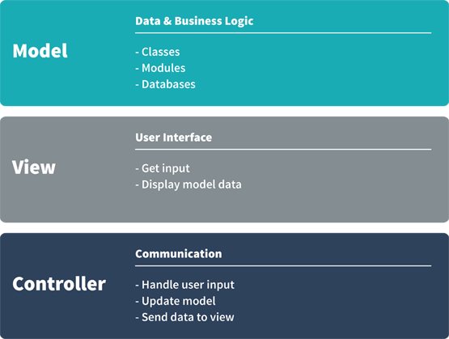

# MVC:  Model-View-Controller
Written by [Torey Hickman](https://github.com/toreyhickman).

## Introduction

Model-View-Controller is a [design pattern](http://en.wikipedia.org/wiki/Software_design_pattern), a template that can be applied to solving problems of a similar nature.  In the case of Model-View-Controller, what does this problem look like?

- I have an application (classes, modules, data, etc.).
- I need to provide a user interface.
- I need to coordinate between the application and the user.

## Dividing Responsibilities
  
In applying object-oriented principles, you've begun to write methods that are responsible for doing a single thing and to write classes and modules that have a single purpose.  Within the Model-View-Controller pattern, your program's responsibilities will be divided between (1) the data and business logic, (2) the user interface, and (3) coordinating between the two.  Figure 1 breaks down the responsibilities of each part of your application.  

*Figure 1.* Model-View-Controller Overview

### Model
The Model handles the data and business logic of your application.  The classes, modules, etc. will become known collectively as your models—going forward, your classes will be backed by databases to persist the state of your application.  

### View
The View handles all the user interface-related responsibilities.  If the user needs to supply input, the View asks for it.  If information needs to be displayed to the user, the View displays it.  In a command-line app, the View handles `gets` and `puts`.

### Controller
The Controller stands between the Model and the View.  The View provides an interface for the user to issue commands and hands them off to the Controller.  The Controller interprets the request and determine what to do.  Generally it will need to talk with and update the Model.  For example, get some data.  It will then take the response from the Model and pass it back to the View, which will display it to the user.

## Application Workflow

*Figure 2.* Model-View-Controller Workflow

Firgure 2 displays a workflow from user input to output in the Model-View-Controller design pattern.  It begins with the user providing input through the interface that the View provides.  The View passes the input to the Controller, which interprets the input.  In this example, the Controller determines that it needs to get some data from the Model, and it requests the data.  The Model then gathers the appropriate data and returns it to the Controller.  The Controller passes the data to the View.  The View displays the data to the user, and the cycle is ready to repeat—the user can send the next piece of input.

## Conclusion

You will continue to encounter the Model-View-Controller pattern while at Dev Bootcamp.  In Phases 2 and 3 the divisions between the parts of your application will be more obvious—your application files will even be divided into *models*, *views*, and *controllers* folders.  Working on the command line in Phase 1, the distinction between parts of our application might feel a little artificial, but implementing the Model-View-Controller pattern is just as doable in this context.

[Video available at talks.devbootcamp.com](https://talks.devbootcamp.com/intro-to-model-view-controller).
