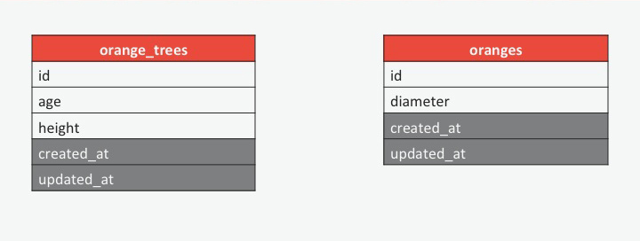

# Introduction to Schema Design

Written by [Casey Cumbow](https://github.com/case-eee) and [Torey Hickman](https://github.com/toreyhickman).

## Introduction

When our programs run, we create and manipulate objects.  For example, we might create orange trees and give these trees some oranges.  Each tree has a specific state:  its age, height, etc.  Each orange has a diameter.  These objects exist in memory, and when the program ends our data is lost.

What if we want to keep track of the current state of our objects so that we can use recreate them later?  In other words, we want to persist the state of our application—just like we would save our progress in a video game. We've worked with one method of persisting data:  CSV.  In the coming week, we'll begin working with databases, a more robust solution to persisting data.

## Modeling Ruby and Databases

We've been modeling real-world systems in Ruby, applying the priniciples of object-oriented design.  We create classes that represent different types of objects in the system:  people, todo lists, orange trees, etc.  

We create individual instances of these object types, each with unique attributes.  One person has the name Susan and the age 25.  Another person has the name Julie and the age 34.

If we want to persist the state of our application in a database (e.g., keep track of the people with their names and ages), we need a database schema, or system, that matches with the system we've modeled in Ruby.

How does the Ruby system relate to the database schema? 

*Figure 1.*  Matching elements of Ruby to databases.

We model the same system in two places (see Figure 1).  Once in Ruby.  Once in the database.  In Ruby, we write classes.  The database needs a corresponding table.  If our Ruby program has a `Person` class, the database should have a `people` table.

In Ruby, we create instances of our classes; for example, the Susan and Julie instances of a class `Person`.  The data that represents the state of each of these people, is recorded in the `people` table.  Each instance of `Person` in Ruby is one record, a row, in the `people` table.

In Ruby, the attributes for an individual person are represented in instance variables.  A `Person` object might have the instance variables `@name` and `@age`.  In the database, the `people` table should have a field, a column, for each of the instance variables.  In this case, the table would have the columns `name` and `age`.

## Modeling Orange Trees and Oranges

Thinking back to the Orange Trees challenge, if we want to build a database schema to model our orange trees and oranges, what would the database look like?  What tables are necessary?  What columns should each table have?

*Figure 2.*  Tables for orange trees and oranges

As for tables, we need one table for each class:  an `orange_trees` table for class `OrangeTree` and an `oranges` table for class `Orange`.

As for the fields on the tables, each orange tree has an age and height held in the `@age` and `@height` instance variables.  Therefore, the `orange_trees` table should have the columns `age` and `height`.  Each orange has a diameter, held in the `@diameter` instance varaible.  The `oranges` table should have a `diameter` column.

Those fields will allow us to persist the states of individual orange trees and oranges.  As seen in Figure 2, in addition to these fields, we'll add a few more columns.

First, we need a way to identify each individual orange tree and each individual orange.  In other words, each needs a *[unique identifier](http://en.wikipedia.org/wiki/Unique_identifier)*.  A very common unique identifier column, is `id`—often a unique integer value for each row in the table.  In addition to the unique identifier, our tables will include timestamps that identify when each record was created and when it was last updated.

## Relationships Between Tables

In our application, there are relationships between specific orange trees and specific oranges.  A particular tree ages and produces oranges that are specific to that particular tree.  Another tree produces oranges of its own.  If we want the state of our application to persist, we need to be able to give each tree its own oranges.

In Figure 2, we've designed our tables to hold the data for our orange trees and oranges.  Now we need to update our schema so that we can link an orange tree with its oranges.  Or, said the other way, link an orange with its orange tree.

First, we need to determine what the relationship between orange trees and oranges is.  In our application, an orange tree grows and keeps track of its oranges.  Said another way, an orange tree *has* oranges.  Looking at an orange, we could say that the orange *belongs to* an orange tree.

- An orange tree has many oranges.
- An orange belongs to an orange tree.

With the relationship between orange trees and oranges understood, we can move on to updating our schema to model this relationship.  We create links between tables in our databases through *primary keys* and *foreign keys*.  Primary and foreign keys are terms used to identify fields on two tables whose values correspond to each other and whose values we can use to match records in one table with records in another table.  The value of the primary key on one table matches the value of the foreign key on another table.

*Figure 3.* Linking the orange_trees table to the oranges table through primary and foreign keys.

Which table should have the primary key and which the foreign key?  This is critical.  The foreign key belongs on the table of the object that belongs to another object.  In this case, an orange belongs to an orange tree.  The `oranges` table should have a foreign key field that identifies to which orange tree each orange belongs (see Figure 3).

The primary key needs to be a field that holds a unique value for every row in a table.  Often, the `id` field will be used as a primary key, as is the case in this example.  The value of `id` is unique to each orange tree in the database.  We'll use each tree's id to link it to its oranges.

The foreign key in this case is the `orange_tree_id` field on the `oranges` table.  The value of this field for each orange will be the id of the tree to which the orange belongs.

Now, given any orange tree's id, I can go to the `oranges` table and find that tree's oranges by looking for that id in the `orange_tree_id` column. Given the value of an orange's `orange_tree_id` field, I can go to the `orange_trees` table and find the orange tree to which that orange belongs.  (See Figure 4)

*Figure 4.*  Linking the primary key `id` on the `orange_trees` table to the foreign key `orange_tree_id` on the `oranges` table.

## Conclusion

In this example, we've modeled a *one-to-many* relationship (i.e. one orange tree to many oranges).  This is a very common database relationship, and you should be sure that you understand how to model it. It is, however, only one type of relationship that you'll be working with.  This weekend you'll have a collection of challenges that explore modeling some of the other relationships (e.g., *many-to-many*).  Remember that regardless of the relationship, we link tables through primary and foreign keys.
