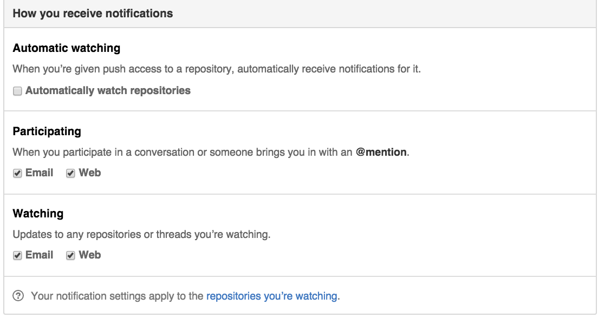
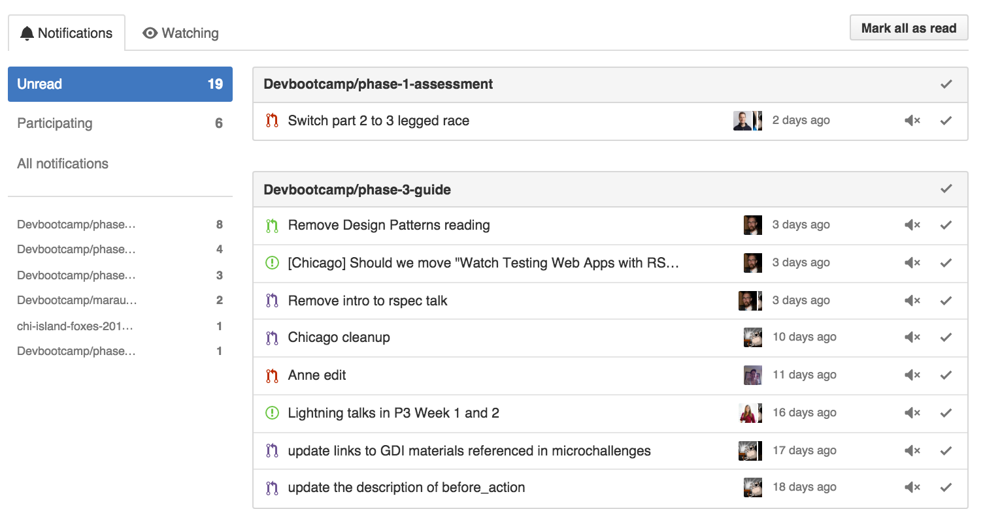

# How to reduce the Github Noise!

These are suggested notification settings... uncheck 'automatically watch' and leave everything checked.

Now follow that link to 'the repositories you're watching'. Unwatch everything and add back only the specific repos you want to watch. If there are specific repos you want to watch in the future (like group projects) you can come back and specifically watch them here.

Note: If you want to keep watching everything, just uncheck the watching email / web checkboxes in the above screenshot to reduce that noise.

Now click on the notifications tab and mark all as read.  (don't worry, you'll have another way to see the ones we just removed that are important to you).  In the future the notifications you see here are now just the ones you want!

We will always mention you in the pull request with '@username' so you can go to 'pull requests' in the top bar and click on 'mentioned' and see the PRs you have been mentioned in.

