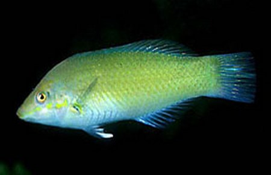

# The DOM Challenge

## Summary
Every time we visit a webpage, our browser first sends a request to the server asking for content, and the server sends back a response with the HTML for the page.

The HTML in the server's response is just text.  But, when the browser receives the response, it parses that text into Javascript objects. Each object represents one HTML element, and they're linked together in a tree structure representing the HTML text.

This collection of objects is known as the *document object model*, or DOM for short.  

If we flip the words around, we could say that the DOM models a document. Typically you start interacting with the DOM by using a variable called `document` which represents the "root node" — the node that is the parent of all the other HTML nodes below it. 

Recall the Phase 1 challenges where we scraped HTML using Nokogiri.  Nokogiri parsed a string of HTML and returned Ruby objects that represented that HTML.  We had one object to represent the whole document, and you used it to call things like `.css` to search through all the Nokogiri `Node` objects.  There were Nokogiri `Node` objects representing each heading, paragraph, etc.  And we could interact with the objects to get the nodes with a certain class, get their child nodes, etc.

The DOM is very similar. We can access nodes with specific classes, get their child nodes, and more — just like we did with the Nokogiri objects.  In the browser, we interact with the DOM via JavaScript.  Let's see how this works.

## Releases
### Release 0:  HTML, the DOM, and Dev Tools
To begin exploring the DOM, we'll take a look at an HTML document and how it's represented by the browser.  In this repository is a file `index.html`.  It's a pretty straightforward HMTL document.  We start with the opening `<html>` tag.  Nested within the `<html>` tag are the `<head>` and `<body>` tags.  Then, within the `<body>` tag are nested more tags, `<header>` and `<main>`.  Read through the file to understand the structure of the HTML document.  What other elements are there?  How are they organized?

When we understand the structure of the HTML, open `index.html` in a browser.  When we open the file, the browser will receive the text of the document and parse it into the DOM.  Each HTML element is parsed into a DOM object, and the DOM objects are organized in a tree structure (see [illustration][html5rocks node tree]).

We can explore the DOM tree using our browser's developer tools ([chrome dev tools][]).  If we're using  Chrome, the DOM is represented to us on the "Elements" tab.  The DOM's tree structure is displayed like an outline which we can explore visually by expanding and collapsing individual branches.  As our cursor moves over a node in the outline, the page view highlights that node.  This is demonstrated in Figure 1.

  
*Figure 1*.  Using Chrome's dev tools to explore the DOM.


### Release 1:  Pulling Information from the DOM
The DOM is an object-oriented representation of an HTML document.  And as we know, objects provide interfaces for interacting with them. The DOM objects are no exception.  In the browser we can interact with the DOM through JavaScript.  In this release, we're going to take a look at how we can pull information out of the DOM.

We'll be working in the browser's JavaScript console ([chrome console][]).  This is part of the dev tools.  In Chrome, it's available on the "Console" tab.  In the console, we can write and execute JavaScript.  It's similar to working in IRB; but it's JavaScript, and we have access to the DOM.

We gain access to the DOM through one object: `document`.  What can we do with this object?  It's the root of the DOM tree, and we can ask it for the element with a certain ID, the elements with a certain class, etc.  Open the console in the dev tools and pull some information out of the DOM; follow along with the code in Figure 2.

```js
// Get the document object.
document;

// Get the title of the page.
document.title;

// Get the element with the id "fish-list".
document.getElementById("fish-list");

// Get all the <span> elements.
document.getElementsByTagName("span");

// Get all the elements with the class "fish-list-card".
document.getElementsByClassName("fish-list-card");

// Get all the <h1> elements that descend from the element with the id "main".
var main = document.getElementById("main");
main.getElementsByTagName("h1");

// Get the children of the first element with the class "fish-list-card".
var firstCard = document.getElementsByClassName("fish-list-card")[0];
firstCard.children;

// Get the text inside the element with the id "wordmark".
var wordmark = document.getElementById("wordmark");
wordmark.innerText;

// Get the value of the id attribute of the first <span> tag.
var firstSpan = document.getElementsByTagName("span")[0];
firstSpan.attributes["id"].value;
```
*Figure 2*.  Pulling information out of the DOM.


Now it's time to pull some information from the DOM on our own.  In the console, pull the answers to the following questions from the DOM.

- What is the address listed on the webpage?
- What is the name of the last fish in the list?
- What is the value of `src` attribute for the image of the black bandit angelfish?


### Release 2:  Updating the DOM
DOM objects also provide methods for making changes to the DOM.  For example, we can change the text that appears on the page, add classes to objects, etc.  We can even create new elements and add them to the DOM.  We'll continue to work in the console with our AquaPals page.  Follow along with the code in Figure 3; as we update the DOM, we'll see the changes reflected in the page view.

```js
// Change the text inside the element with the id "wordmark".
var wordmark = document.getElementById("wordmark");
wordmark.innerText = "Aqua-Pets";

// Add the class "light" to the element with the id "wordmark".
wordmark.className += " light";

// Change the text inside the first <h1> tag in the element with the id "main".
var main = document.getElementById("main");
var mainHeading = main.getElementsByTagName("h1")[0];
mainHeading.innerText = "Fish for $ale";

// Create a <footer> element and append it to the end of the <body>.
var footerText = document.createElement("span");
footerText.innerText = "AquaPals - 2016"
var footer = document.createElement("footer");
footer.id = "footer";
footer.className = "light flex-column";
footer.appendChild(footerText);
footer    // Take a look at the element we've built.
var body = document.getElementById("body");
body.appendChild(footer);    // The footer element appears at the page view bottom.

// Update the styling of the <footer>.
footer.style.paddingTop = "6em";
footer.style.paddingBottom = "6em";
```
*Figure 3*.  Updating the DOM through JavaScript.


We're going to make some updates on our own, but before we do, refresh the page.  What happened to our changes?  They're gone!  Why?  Remember, when the page loads, the browser parses the document into the DOM.  The DOM is an object that represents the HTML, but it is not the HTML.  When we edit the DOM, we're only changing the objects in the DOM tree.  We're not editing the HTML file from which the DOM was built.  When we refresh the page, the browser re-parses the file and builds a new DOM tree.

Now it's time to update the DOM on our own.  In the console, make the following changes.

- Change the name of the "Akindynos Clownfish" to be "Clownfish".
- Add another fish to the list using only Javascript (no editing the HTML file).  The image file is provided, and the elements to add would look like this in HTML.

  ```
  <li id="fish-9" class="fish-list-card flex-column light">
      
      <span class="fish-list-card-name">
        Green Wrasse
      </span>
  </li>
  ```


### Release 3:  Listening for Events
When users interact with a webpage, they click on elements, submit forms, etc.  These are events for which DOM objects can listen.  For example, we can take a DOM object and instruct it to listen for the user to click on it. When we do so, we provide a callback function to execute if the click takes place—if a click event occurs, run this function.  Continuing to work in the console with our AquaPals page, lets add an event listener.  Follow along with the code in Figure 4.

```js
// Define a function that will open an alert box.
function alertWordmarkClick() { alert("You clicked the wordmark."); }

// Listen for click events on the element with the id "wordmark".
var wordmark = document.getElementById("wordmark");
wordmark.addEventListener("click", alertWordmarkClick);
```
*Figure 4*.  Adding event listeners to DOM objects.

We've now set up an event listener so that if we click on the "AqualPals" wordmark, an alert box will open.  Maybe the user will click the wordmark, maybe not.  But, if it does happen, the alert box will open.  All right, let's go ahead and click on the wordmark to see the alert box open.


## Conclusion
In this challenge we've explored the document object model and how to interact with it.  When the browser makes an HTTP request and the server responds with HTML, the browser parses the HTML into the DOM.  The DOM is an object-oriented representation of the HTML.  The objects that comprise the DOM provide interfaces which we can use to interact with them.  In the browser, we interact with the DOM using JavaScript.  This allows us to pull information from the DOM, update the DOM, and listen for and respond to events.


[chrome console]: https://developer.chrome.com/devtools#console
[chrome dev tools]: https://developer.chrome.com/devtools
[html5rocks node tree]: http://www.html5rocks.com/en/tutorials/internals/howbrowserswork/#DOM
