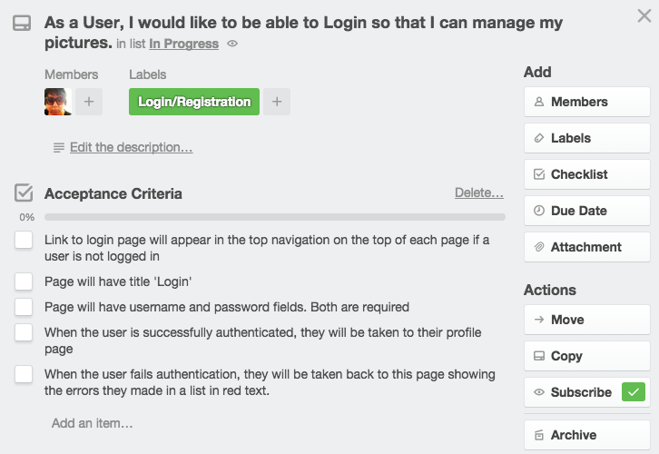
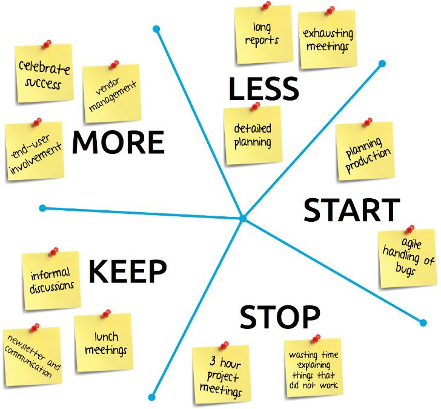

# Agile & Team Workflow

Up to this point we've had smaller group projects.  In phase 2 the scope of these projects starts to get bigger.  More files, more features, more commits, more CODE.  This resource is a **must read** before you go into your first Phase 2 group project.

## Overview

This resource covers these topics:

- [Agile Overview](#agile_overview)
- [Agile Cadence](#cadence)
- [Vertical Slices](#vertical_slices)
- [How to Agile](#how)
  - [Team Norms](#team_norms)
  - [Team Standups](#standups)
  - [Story Cards](#story_cards)
  - [Big Visual Board](#bvb)
  - [Wireframing](#wireframes)
  - [Retrospectives](#retros)
- [Git Workflow for Teams](#git)

<a id="agile_overview"></a>
## Agile Overview

### Agile's Basic Principles

Agile Software development consists of 12 basic principles :

- Our highest priority is to satisfy the customer
through early and continuous delivery
of valuable software.
- Welcome changing requirements, even late in
development. Agile processes harness change for
the customer's competitive advantage.
- Deliver working software frequently, from a
couple of weeks to a couple of months, with a
preference to the shorter timescale.
- Business people and developers must work
together daily throughout the project.
- Build projects around motivated individuals.
Give them the environment and support they need,
and trust them to get the job done.
- The most efficient and effective method of
conveying information to and within a development
team is face-to-face conversation.
- Working software is the primary measure of progress.
- Agile processes promote sustainable development.
The sponsors, developers, and users should be able
to maintain a constant pace indefinitely.
- Continuous attention to technical excellence
and good design enhances agility.
- Simplicity--the art of maximizing the amount
of work not done--is essential.
- The best architectures, requirements, and designs
emerge from self-organizing teams.
- At regular intervals, the team reflects on how
to become more effective, then tunes and adjusts
its behavior accordingly.

The 4 core Agile values that sum these up can be found here: [Agile Manifesto](http://www.agilemanifesto.org/)

These might not make sense to you if you haven't already had a career in programming.  The overall goal of this resource is to help you understand how they might inform your work.

### Huh?
That may sound like a lot of business speak, but let's boil that down into things that make sense for our needs.

- Let's show our work to the people we are building it for the stakeholder/client often so that we are all on the same page.
- Let's value high quality code.
- Let's work in a way that we can sustain this pace for a long time and not burn out.
- Let's communicate often as a team preferably by being located in the same physical location.
- If things go wrong, let's react and change quickly before we get too far.
- Let's talk about what's going well and improve often so we can be a high performing team.  

It's really just a set of reminders to keep the things that matter at the forefront of your development process so that your project can be successful.  These things help you move toward a high performing, self-organizing team that trusts each other to get their work done.

### How we got here

Agile was born from the tensions teams encountered when planning out huge projects, start to finish, in the face of uncertainty; if you're two months deep into a six-month plan, and the market changes, it's too late to turn back. [Here's a brief history](https://www.blossom.co/blog/agile-software-history) of tech's slow shift from the old "Waterfall" model to Agile methods.

<a id="cadence"></a>
## Agile Cadence

Agile cadence is the rhythm in which you do your work as a team. It's not meant to be prescriptive, merely a suggestion on how you can organize the practices we describe later. If it doesn't work for you, adapt and try something else!

In the workplace, 2 weeks 'sprints' are common.  The sprint is you working on a set of stories for a fixed time period and then showing deliverable work at the end of that time.

Here's a basic sprint overview.  We'll dive into what each of these bold terms mean in a moment:

- Decide what will be worked on during that sprint from the **backlog**.  Do that at the beginning of the sprint period.  
- Daily you will have **standups**.  You do this at a regular frequency until you reach the end of the sprint.  
- At the end of the sprint, you demo your completed work for the client.  
- Once that is complete, you have a **retrospective** to improve on how to work better together in the next sprint.    

Here at DBC, you can break your sprints down into a day, or even a half day depending on how you and your team decide to work.

<a id="vertical_slices"></a>
## Vertical Slices

Vertical slices aren't really a practice, but a way to break down your work.  Knowing this concept is helpful when defining your story cards in a later section.  It also helps with assigning work in your team.  **We really want you to practice this.   Horizontal slicing doesn't really work for good team workflow.**

Horizontal Slicing vs Vertical Slicing

| Horizontal                    | Vertical                       |
|-------------------------------|--------------------------------|
| Person 1 does all JS          | Pair 1 does Sign-up story      |
| Person 2 does all HTML/ERB    | Pair 2 does Login story        |
| Person 3 does all controllers | Pair 1 does User Profile story |
| Person 4 does all Models      | Pair 2 does Post Create story  |

Each vertical slice is deliverable to the client!  If someone does all the controllers, what will you have to show them?

Let's break that first vertical slice ("Pair 1 does Sign-up story") into finite tasks for that pair to complete:

- Make a link somehwere to get to the sign-up page
- JS needed for sign-up page (if any)
- HTML form on users/new erb template
- controller route for `get '/users/new'` route
- controller route for `post '/users'` route
- User model with bcrypt
- User table migration

Here is a visual representation:


If the team breaks up work in horizontal slices, nothing is 'done' until everything is done. With vertical slicing you can start delivering something you can show your client with each slice delivered!

<a id="how"></a>
# How to Agile

It's far more important for a team to be agile than to do "Agile". There are many branded frameworks (Scrum, Kanban, XP, Lean) that promise to improve teams' Agile processes... but remember, agile development is about valuing individuals and interactions over processes and tools!

That said, it's helpful to know what's already worked well for many high performing agile teams. Let's talk about some suggested practices you can try as you develop your team workflow:

- team norms
- standups
- story cards
- big visual board
- wireframing
- how and when to do feedback

__*Once you get these things squared away, you will be ready to start coding related work.*__

<a id="team_norms"></a>
## Team Norms

Team norms are basically a set of values/rules the team will adhere to in order to get work done.  It's how you all agree to work together.  

Students often find that sometimes these team norms fly out the window as their 'due date' gets near, but it's important to hold each other accountable to what you have agreed to do.  When team norms breakdown, inefficiencies crop up. People may get out of sync on what's important, or may duplicate their efforts. Progress quickly slows to a halt.  If the norms need to change, you can adapt, but do so as a group.

When starting a project at DBC, team norms are a good thing to decide on first.

Some examples of team norms are:
- Standups at Morning, Midday, Day's End
- A different person will code review and merge your PR.
- Have Fun!
- Resolve team dissonance when it's happening.
- Help each other out if you get stuck.
- Listen to each other.
- If you push to master, that person does a treat run for the rest of the group.
- Each team member will stretch on something they struggle with.

Additional Resource: [Creating Team Norms](http://www.agileconnection.com/article/creating-team-norms)

<a id="standups"></a>
## Team Standups

Team standups are a way for the team to communicate often on the work being done by the group.  Typcially the client, devs, testers, leads will be a part of that standup.  It's important to have all the major participants in the day to day involved so that if there are any roadblocks, they can be escalated quickly.

Typically each team member will quickly state:

- What did you do yesterday?
- What will you do today?
- Are there any impediments in your way?

With our compressed DBC timeline, we could say:
- What did I do since the last standup?
- What work will I tackle before the next standup?
- Am I stuck on anything?

This high level of communication helps everyone know at a high level what everyone else is doing.    

Additional Resource: [Daily Scrum](http://www.mountaingoatsoftware.com/agile/scrum/daily-scrum)

<a id="story_cards"></a>
## Story Cards

Story cards are basically a set of high level requirements of what the user wants in the system you are developing.  A set of related story cards can sometimes be called a feature.  

We call them cards, because when all this agile stuff started we just used index cards!

Example story cards *may* contain any of the following info:

- Title
- Description (As an `<actor>`, I would like to `<action>`, so that `<value>`)
- Type (User Story, Technical, Spike, Defect)
- Acceptance Criteria (What it means to be done)

### Types of Cards

- **User Story** - A basic card that maps to a requirement from the client.

- **Technical** - Technical work that has to be completed by the team

    Examples:

    - Set up Github repo
    - Setup Auto-deployment to Heroku
    - Setup Travis
    - Schema Design


- **Spike** - a research card that is timeboxed for something unknown about the project.  

    Examples:

    - Investigate Music API Options
    - Figure out D3 for charting
    - Investigate Sign-in with Google
    - Evaluate React Native vs Ionic frameworks


- **Defect** - a card for a bug either found during a test cycle or production.

### Basic Story Card Examples

Basic Note Card example with acceptance criteria.


Sample Trello Story Card with Description and Acceptance Criteria.



[Example Completed Trello Story Card](https://trello.com/c/nDlumpPq) showing signoff, and dev tasks.

Additional Resource: [User Stories - Mountain Goat Software](https://www.mountaingoatsoftware.com/agile/user-stories)

<a id="bvb"></a>
## Big Visual Board

A big visual board is just a place for you to display what is being worked on by the team.  It can be a white board with post its, or a digital board like trello or pivotal tracker.  

It should reflect the work being done at any given time by your team.  If your client comes by and looks at it, they should be able to know what work is complete and remaining.  

Interacting with your board so that it reflect current state of the work is key.  It requires practice if that is what is important to your team.

Basic lanes on your board:
- Backlog - a prioritized list of all the remaining work to be done.
- To Do - Work for the current iteration (2 week period, day, month)
- Blockers - A section for work that is stopped due for other reasons (api down, server being rebuilt, etc.)
- In Progress - Work currently in progress by your team
- Done - Work that has been reviewed by your client and is deemed 'complete'.

One thing to note.  Try to limit the work in the 'In Progress' column.  If you have more than 1 card that you are working in that column, that should be a bit of a smell.  Work one thing per person/pair and then take it to completion before pulling in something else.

[Trello example](https://trello.com/b/TYsWqRFg) - This is an  example of a project that I put together to demonstrate a _**really complete**_ board.  It shows cards in each status, with acceptance criteria, dev tasks, and each type (tech, spike, etc by using labeling).  Take a look around here.  

White Board Example (each post-it is a card)


Additional Resource: [Kanban Board](http://leankit.com/learn/kanban/kanban-board/)

<a id="wireframes"></a>
## Wireframing

Wireframes are like a story board for your website.  Sketching these out after defining story cards but before starting work will help the entire team agree on the flow and high level visual design of your application.  

Here are 2 samples:


Additional Resource: [Wireframes - A Great Way to Start Development Projects](http://www.infoq.com/articles/wireframes-start-development-projects)

<a id="retros"></a>
## Retrospectives

Retrospectives or 'Retros' are a time at the end of your sprint where you reflect on the work done so that you can work better during the next one.  

Easy ways to do this is give everyone a stack of post-it notes and have them write things for each of the following categories.  
- Continue doing
- Stop doing
- Start doing

Everybody will then vote on their top three or X number of items as defined by the team. The ones with the top number of votes will be the things the team tries to work on for the sprint!


Another retro example



Additional Resource: [Sprint Retrospective](https://www.mountaingoatsoftware.com/agile/scrum/sprint-retrospective)

<a id="git"></a>
## Git Workflow for Teams

Git workflow for teams is a bit different.  You will be working in feature branches instead of pair branches.  So if someone is working on a story for Login, the branch name might be login.

When working on a group project, you will be starting with a brand new repository which you will create as a private repository in your github organization.

1. [Create a new repository on github](https://help.github.com/articles/create-a-repo).  Make sure your entire team is a collaborator on the project.

2. Clone this repository (empty except for a README.md file) to your local repository.

  ```shell
  git clone REPOSITORY_PATH
  ```

3. Create a branch for each new feature

  ```shell
  git checkout -b featureX
  ```

4. Work on your feature, commit often.

  ```shell
  git add newfile
  git commit -m "added tests to featureX"
  ```

5. When you have working, complete code for your feature, make sure and do a commit to your local feature branch of any outstanding code.

6. Update master locally since others may have merged their completed work to master in this time period.

  ```shell
  git checkout master
  git pull origin master
  git checkout featureX

  ```
7. Merge updated master into your branch and resolve conflicts.

  ```shell
  git merge master
  ```

  It will tell you if there are any merge conflicts.  Hand edit the files and then make sure your app still works.  If you are done, then you shouldn't see anything like this in any files.

  

  Remember, you branch change is the code below the '='
 the code from master is above it.  You have to decide which code you want to keep.

  An easy way to check to see if you fixed all the merge conflicts is search for those repeated '=', '<', or '>' symbols.

8. Do a final commit after resolving all the merge conflicts and push your branch to github.  Submit a pull request to master.

  ```shell
  git push origin featureX
  ```

9. Since this pull request is to your team repository, you **CAN** merge into master. A good workflow is to require another teammate to review your pull request and merge it.

10. Before working on a another feature, make sure you always have the latest version of master by first merging any open pull requests on github and then pulling these changes into your local master branch.

  ```shell
  git checkout master
  git pull origin master
  ```
